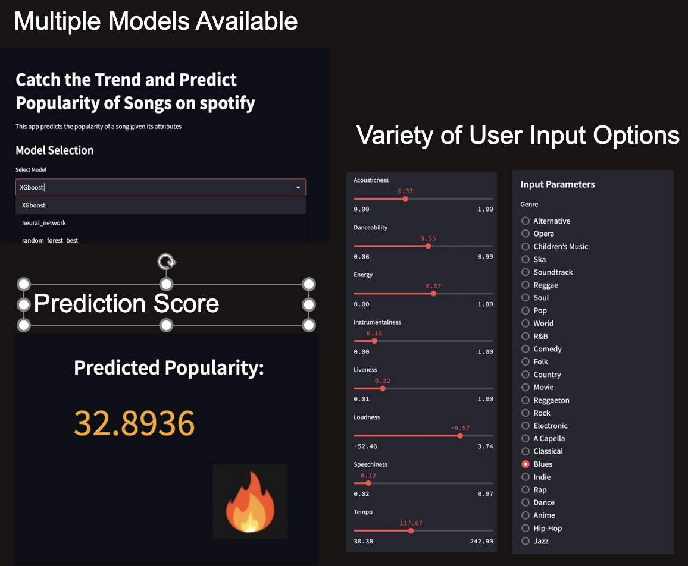
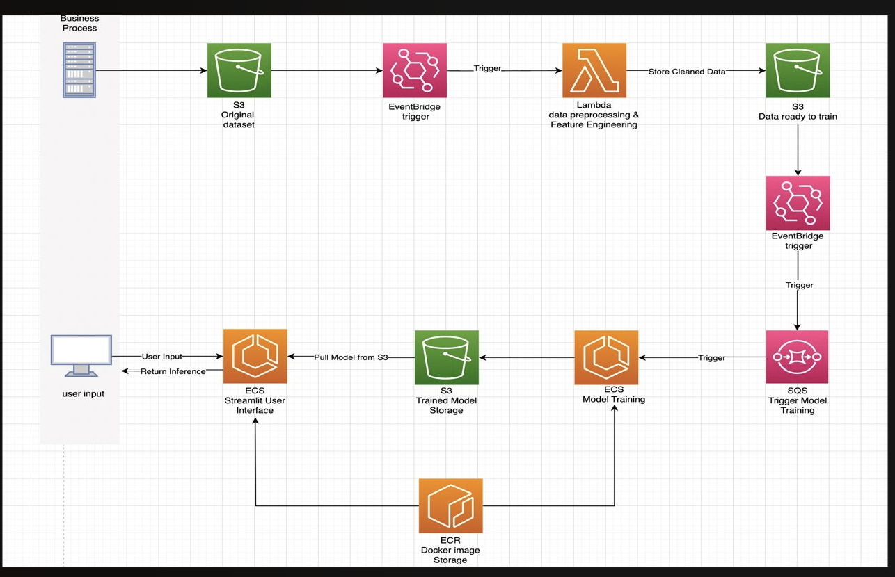

ChartBuster: Your Crystal Ball for Predicting Billboard Hits!
====================================================================================

**Table of Contents**
-----------------

1. [Project Overview](#project-overview)
2. [Files Structure](#files-structure)
3. [Installation & Setup](#installation-setup)
4. [App Features](#app-features)
5. [App Architecture](#app-architecture)
6. [AWS Architecture](#aws-archetecture)

Authors: Vivi Wang, Hanwei Hu, Anthony Yang, Robert Chen
## **Project Overview**
ChartBuster is here to solve one of the biggest mysteries in the music world: what makes a song popular? No need to ponder over countless variables or base your judgments on gut feelings. Our state-of-the-art prediction model will handle the complexity and offer you predictions in a user-friendly, interactive format.

Powered by Streamlit and deployed on AWS Cloud, ChartBuster harnesses the power of AI to predict song popularity based on user-provided attributes. Leveraging sophisticated ML algorithms and a comprehensive dataset, we have created a tool that goes beyond simple prediction—it delivers insights, empowers decision-making, and uncovers the unseen patterns of song popularity.

Whether you're a budding artist dreaming of topping the charts, a record producer searching for the next big hit, or a music lover who loves predicting trends, ChartBuster is your backstage pass to the future of music. Get ready to step into the spotlight and turn the music industry on its head! 🚀🎸🎧

## **Files Structure**


Pipeline Directory
------------------

This directory is dedicated to everything related to the training of our machine learning model. It includes the following files:
    
1. `src/train_model.py`: Here, the actual training of the machine learning model occurs. It involves feeding the processed data to the model and tuning it to find the optimal parameters.
    
2. `src/evaluate_performance.py`: This script is responsible for assessing the performance of the trained model using various evaluation metrics.
    
3. `src/score_model.py`: This script is responsible for assessing the performance of the trained model using various scores metrics.

4. `src/aws_utils.py`: This script is responsible for enabling the AWS service with python. 
    
5. `main.py`: This script is the main script for running the training pipeline. 

Streamlit Directory
-------------------

The Streamlit directory contains all the components required for the user interface of the application:

1. `streamlit_infer.py`: This is the main script that runs the Streamlit app. It interacts with the user, accepts song attributes as input, uses the trained model to predict popularity, and presents the results.
    
2. `input_feature_eng.py`: This script contains feature engineering utility functions that transform user input into what the model can recognize.
    
3. `model.pkl`: This is the trained machine learning model that is imported by `app.py` for making predictions.


## **Installation & Setup**

Prerequisites
-------------

Here are a few things you'll need before we start:

1. Python 3.7 or later: Python is our core programming language. If you haven't already installed it, head over to the official [Python website](https://www.python.org/) to download the latest version.
    
2. AWS Account: Since our app is deployed on the AWS cloud under MSIA Account, you'll need an AWS account and corresponding credentials from MSiA. For more infomation to create the accnount, you can refer to: [AWS website](https://aws.amazon.com/).
    
3. AWS CLI: The AWS Command Line Interface is a unified tool to manage your AWS services. You can download it [here](https://aws.amazon.com/cli/).
    
4. Streamlit: This is the engine that powers our app. Don't worry if you haven't used it before, it's easy to install and incredibly user-friendly!

5. Docker install(optional)

+ Follow the official Docker installation guide for your operating system:

    *  [Install Docker on Windows](https://docs.docker.com/desktop/windows/install/)
    *   [Install Docker on macOS](https://docs.docker.com/desktop/mac/install/)
    *   [Install Docker on Ubuntu](https://docs.docker.com/engine/install/ubuntu/)


Installation Steps
------------------

Let's get your system ready to run ChartBuster:

1. **Clone the Repository**: 
    ```bash 
    git clone https://github.com/MSIA/Cloud_Project_Group11.git
    ```
2. **Create a Virtual Environment**: This is an optional step, but it's a good practice to create a virtual environment for your Python projects.
    ```bash
    python -m venv venv
    source venv/bin/activate
    pip install -r requirements.txt
    ```
3. **Install the Required Packages**: We've made this step easy for you. All the required packages are listed in the `requirements.txt` file. All you need to do is run `pip install -r requirements.txt`, and Python will handle the rest!


## **App Features**


## **App Architecture**

🏗️🔍📊 ChartBuster is not just a simple web app - it's a fine-tuned blend of sophisticated technologies, working together in harmony. Our architecture utilizes Amazon Elastic Container Service (ECS) for both model training and app hosting, with Amazon S3 providing robust and secure storage for our data.

Presentation Layer
------------------

This is where your journey with ChartBuster begins. Built with Streamlit, this layer focuses on delivering an intuitive and engaging user experience. Here, you can input song attributes and receive predicted popularity results, all presented in a visually appealing and easy-to-understand format.

Application Layer
-----------------

Housed in an ECS container, this is where our machine learning model resides. The model is trained on a rich dataset stored in an S3 bucket, using the power of ECS to handle the computational requirements of the training process.

Once the model is trained, we store the trained model into S3 bucket.

Data Layer
----------

The backbone of our application, the Data Layer, is responsible for all things data-related. We utilize two S3 buckets in this layer


## **AWS Archetecture**


+ Amazon S3: S3 serves as our data storage platform, and we use two separate buckets for efficiency and organization. 

    1. **msia423-group11-spotifty**: This is where all our raw song data is securely stored. This raw data is then processed and transformed into a format that our machine learning model can consume.
        
    2. **msia423-group11-spotifty-ready-to-rain**: After processing, the ready-to-use data is stored in a separate S3 bucket. This segregation of raw and processed data not only keeps our data organized but also ensures efficient access and use by our machine learning model.

    3. **msia423-group11-spotify-artifacts**:
    After training, the model file is stored within this bucket, which allows the app using the pre-trained model.

+ Amazon ECS: Our application and machine learning model reside in ECS, where they are packaged into Docker containers. We utilize ECS for both the model training process and to host our Streamlit app.

    1. **group11-prediction-pipe**: This is the ECS container for hoting the streamlit App. It get the model.pkl file from `msia423-group11-spotify-artifacts` and then push the app into http host. 

        - ECR: `group11-prediction-pipe-virginia`
        - Task definition: `group11-prediction-UI`

    2. **group11-train-pipe**: This is the ECS container for training the model. It is triggered by SQS(`group11-sqs`) which get messages once the `msia423-group11-spotifty-ready-to-rain` get something new.
    It puts the trained model.pkl files and other artifacts into artifacts bucket. 

        - ECR: `group11-training-s`
        - Task definition: `group11-training-pipeline-sqs`
+ Amazon Lambda: We employ Lambda for handling our data preprocessing and feature engineering tasks. As serverless compute service, Lambda is excellent for handling event-driven processes, making it ideal for our use case.

    1. `group11-Create_data`: It is a lambda function and trigger by S3 object create event of `msia423-group11-spotifty` bucket and then applied preprocessed data into the `msia423-group11-spotifty-ready-to-rain` bucket with two files:

        - cleaded_data.csv: Data after preprocessed
        - ready_data.csv: Data after feature Engineering such as OneHot Encoding, log transformation, and so on.
+ Amazon SQS:
SQS (Simple Queue Service) is used as a message queue service to decouple and scale microservices, distributed systems, and serverless applications. SQS buffers requests, helping to smooth out any volatile workloads.

    1. `group11-sqs`: It is linked with `msia423-group11-spotifty-ready-to-rain` bucket and `group11-train-pipe` ECS. It get messages from the bucket and then sent to the training pipeline, Which allows the batch training. 

